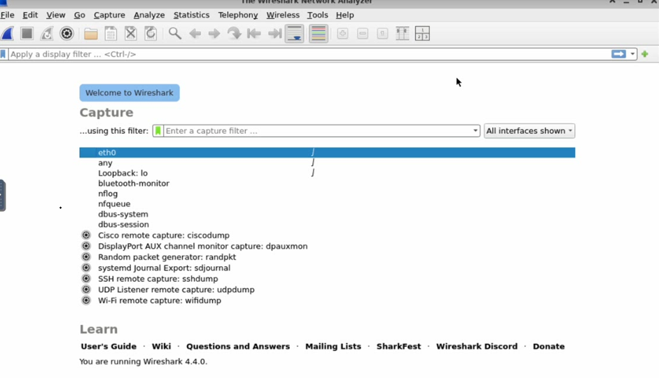
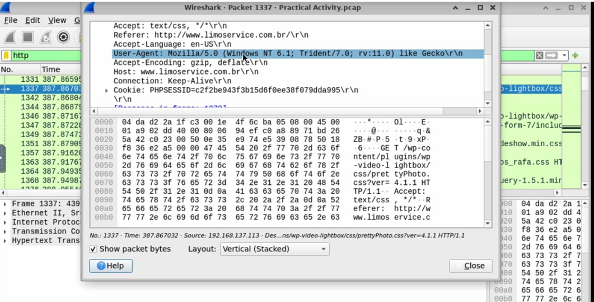
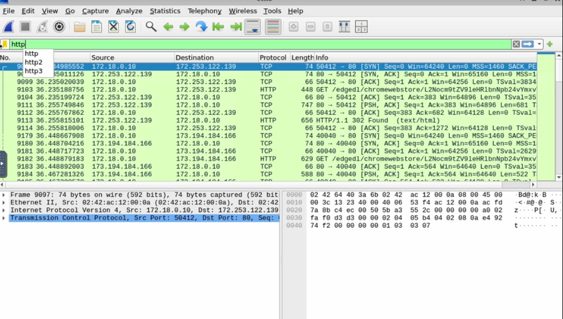
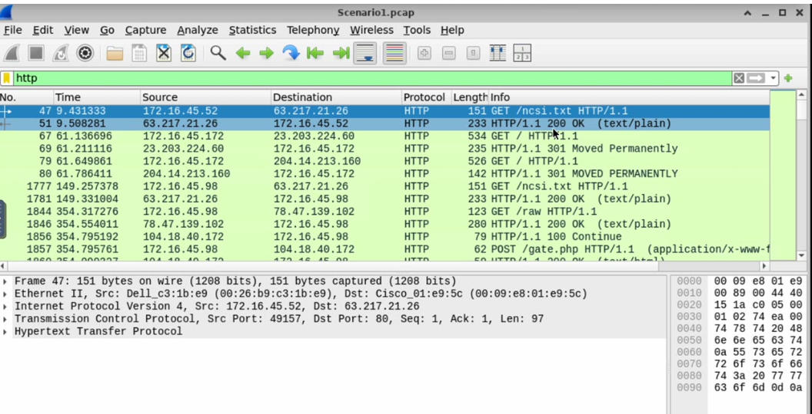
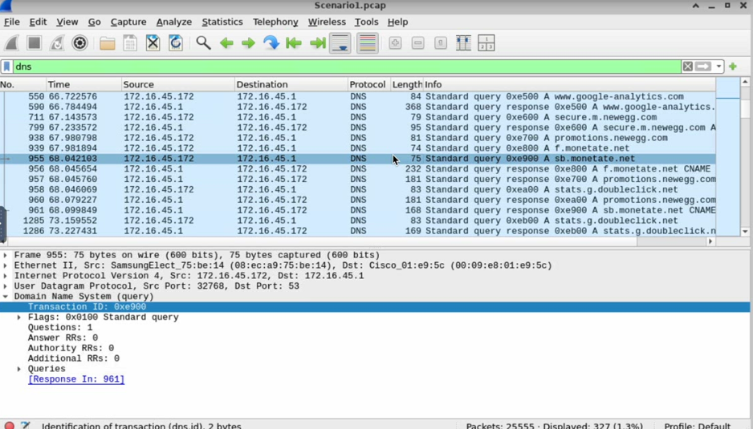
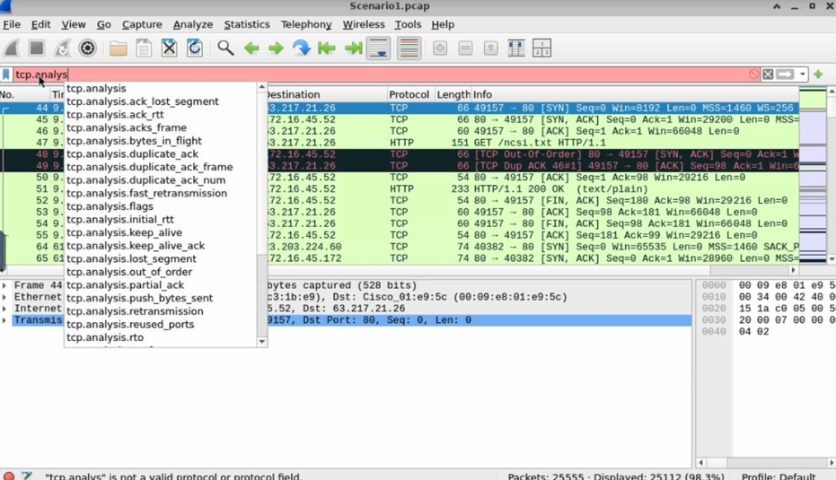

# Wireshark Traffic Analysis Lab


## 📖 Project Overview

This project demonstrates practical network traffic analysis using Wireshark. The objective was to capture, filter, and analyze network traffic while investigating HTTP, HTTPS, DNS, and TCP communications.

Through hands-on packet analysis, I learned how to identify web traffic patterns, inspect network protocols, troubleshoot connectivity issues, and detect potential security concerns.

---

## 🎯 Objectives

* Navigate and utilize Wireshark's interface effectively
* Capture live network traffic
* Apply display filters to isolate specific traffic
* Analyze HTTP and HTTPS communications
* Investigate DNS requests and responses
* Examine TCP performance metrics
* Identify potential network anomalies
* Troubleshoot common network issues

---

## 🛠️ Technologies Used

| Technology   | Purpose                     |
| ------------ | --------------------------- |
| Wireshark    | Packet Capture & Analysis   |
| Ubuntu Linux | Operating System            |
| HTTP         | Web Traffic Analysis        |
| HTTPS        | Secure Web Traffic Analysis |
| DNS          | Domain Resolution Analysis  |
| TCP/IP       | Network Communication       |

---

## 💡 Skills Demonstrated

* Packet Capture
* Traffic Filtering
* Network Troubleshooting
* Protocol Analysis
* DNS Investigation
* HTTP Request Analysis
* HTTPS Traffic Identification
* TCP Performance Monitoring
* Security Awareness
* Network Monitoring

---

## 📋 Project Tasks Completed
 
### 1️⃣ Install and Configure Wireshark
- Installed Wireshark on Ubuntu
- Configured packet capture permissions
- Verified network interface visibility

 
---
 
### 2️⃣ Capture Network Traffic
- Started packet captures on Ethernet interfaces
- Generated network activity
- Saved packet capture files for analysis

 
---
 
### 3️⃣ Analyze HTTPS Traffic
Applied Wireshark display filters to identify encrypted web traffic.
 

 
---
 
### 4️⃣ Analyze HTTP Traffic
Filtered and inspected HTTP packets to examine request and response details.
 

 
---
 
### 5️⃣ Detect Website IP Addresses
Identified destination IP addresses by filtering captured traffic and examining packet details.
 

 
---
 
### 6️⃣ Investigate DNS Activity
Analyzed DNS queries and responses to understand domain name resolution processes.
 

 
---
 
### 7️⃣ Examine TCP Communication
Reviewed TCP handshakes, retransmissions, and latency indicators.
 

 
---
 
### 8️⃣ Capstone Activity
Captured and analyzed Ethernet traffic containing both HTTP and HTTPS communications while identifying network behavior patterns.

---

## 🔍 Key Wireshark Filters Used

### HTTP Traffic

```wireshark
http
```

### HTTPS Traffic

```wireshark
tcp.port == 443
```

### DNS Traffic

```wireshark
dns
```

### Filter by IP Address

```wireshark
ip.addr == 192.168.1.1
```

### Exclude an IP Address

```wireshark
!(ip.addr == 192.168.1.1)
```
